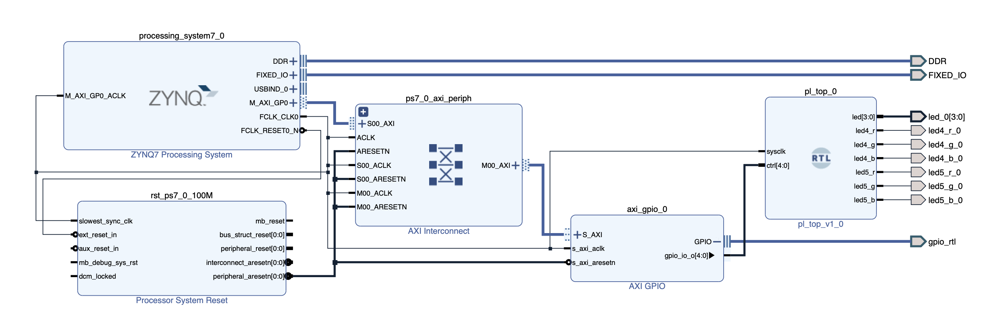

# Dual RGB PWM Controller (Zynq PS + PL, AXI GPIO)

## Tools and Platform

- Board: PYNQ-Z2 (Zynq-7000)
- HDL: VHDL
- FPGA tools: AMD/Xilinx Vivado
- Software tools: AMD/Xilinx Vitis

## Overview

This project implements a dual-channel RGB LED dimmer on FPGA.

Originally, the design was controlled using physical buttons and switches implemented in Programmable Logic. It was later extended to support software control from the Zynq Processing System (ARM Cortex-A9) via AXI GPIO.

A bare-metal software application running on the ARM processor controls brightness of two independent RGB LEDs implemented in Programmable Logic.

Each RGB LED maintains independent brightness values for Red, Green and Blue channels.

The hardware is written in VHDL and targeted for the PYNQ-Z2 board.

## Features

### Phase 1–2 (hardware-controlled)

- Two independent RGB dimmers
- 8-bit PWM brightness control (256 levels)
- Channel select (R/G/B)
- Brightness up/down using hardware buttons
- LED indicators for active channel and active RGB

### Phase 3 (software-controlled via Zynq PS)

- Brightness control via AXI GPIO interface
- Software control from Zynq Processing System
- Full PS–PL integration

## Controls

### Phase 1–2 (hardware buttons)

- BTN0 – Reset
- BTN1 – Select channel (R → G → B)
- BTN2 – Brightness up
- BTN3 – Brightness down
- SW0 – Select active RGB (0 = RGB4, 1 = RGB5)

Indicators:

- LED[2:0] – selected channel (R/G/B)
- LED[3] – active RGB LED

### Phase 3 (software control via AXI GPIO)

In Phase 3, physical buttons were replaced by software-generated control signals.

Control bit mapping:

- CTRL[0] – Reset
- CTRL[1] – Select channel (R → G → B)
- CTRL[2] – Brightness up
- CTRL[3] – Brightness down
- CTRL[4] – Select active RGB (0 = RGB4, 1 = RGB5)

These signals are generated by the ARM processor and sent to the PL via AXI GPIO.

## Phase 1 (Functionality)

Implemented a basic dual RGB dimmer using:

- clock dividers
- button pulsers
- two RGB controllers
- six PWM generators

Functional but structurally flat (all blocks instantiated directly in the top-level module).

### Behavior

- Both RGB4 and RGB5 use PWM brightness control
- Each LED keeps independent R/G/B values
- Switching SW0 does not reset the other LED
- Only the selected LED responds to button inputs

### Architecture

The design contains:

- 2 × `rgb_controller` (independent state machines)
- 6 × PWM generators (3 per RGB LED)
- shared button pulsers
- shared clock dividers
- simple multiplexing logic based on SW0

## Phase 2 (IP-block design)

Architecture was redesigned to reduce duplicated logic and introduce reusable IP-style blocks.

### Changes

- introduced `rgb_pwm_core` → reusable PWM hardware engine (3× PWM)
- introduced `rgb_dimmer_ip` → controller + PWM core combined
- shared clock dividers and button pulsers in in the top-level module
- in the top-level module now instantiates **two clean IP blocks**

### Resulting architecture

```
top-level module
├─ shared clk_divider (1 kHz)
├─ shared clk_divider (PWM)
├─ shared button_pulsers
├─ rgb_dimmer_ip (RGB4)
└─ rgb_dimmer_ip (RGB5)
```

Benefits:

- cleaner hierarchy
- reusable modules
- easier scaling

## Phase 3 (Zynq Processing System control via AXI)

In Phase 3, the design was extended to allow control from the Zynq Processing System (PS) instead of physical buttons.

The original hardware top module was renamed to `board_top.vhd`, and a new `pl_top.vhd` module was created for AXI GPIO integration.

The original button and switch inputs were replaced with a software-controlled interface using AXI GPIO.

The PS now simulates the following control signals:

- reset
- select channel
- brightness up
- brightness down
- active RGB select (SW0 equivalent)

This allows full control of the RGB dimmers from software running on the ARM processor.

---

## Block Design (Vivado)

A Vivado Block Design was created to connect the Processing System to the custom PL logic.



### Block Design structure

The design includes:

- Zynq Processing System (PS7)
- AXI Interconnect
- AXI GPIO (5-bit output)
- custom PL module (`pl_top`)

### Integration steps performed

The following steps were completed in Vivado Block Design:

- added Zynq Processing System and AXI GPIO IP
- connected Processing System to AXI GPIO using AXI interface
- configured AXI GPIO as 5-bit output
- added custom PL module (`pl_top`)
- connected AXI GPIO output to `ctrl` input of `pl_top`
- connected system clock (100 MHz) and reset signals from PS to AXI and PL modules
- validated Block Design
- generated HDL wrapper
- set wrapper as top module

After that, constraints were updated to match the new `pl_top` ports.

The hardware platform was then exported to generate the `.xsa` file.

This file is located in:

```
hw/rgb_pwm_system_wrapper.xsa
```

This file is used by Vitis for software development.

---

## Software Control (Vitis Bare-Metal Application)

After exporting the hardware platform from Vivado, software was developed in Vitis to control the RGB dimmers from the ARM processor.

### Platform creation

A Vitis platform was created using the exported hardware file: `rgb_pwm_system_wrapper.xsa`

This platform provides access to the AXI GPIO peripheral connected to the PL.

---

### Application

A bare-metal application was created inside this platform.

Source file:

```
sw/baremetal/dual_rgb_dimmer_demo.c
```

This program controls the RGB dimmers by writing control values to AXI GPIO.

The software simulates button presses and switch selection exactly like a human user would operate the board.

---

### Software functionality

The application performs the following actions in a loop:

- resets both RGB dimmers
- increases brightness of RGB4 (Red → Green → Blue)
- increases brightness of RGB5 (Red → Green → Blue)
- resets both dimmers
- increases brightness of RGB5
- decreases brightness of RGB5

This verifies:

- AXI communication
- independent dimmer operation
- correct color channel selection
- correct brightness control

---

### Hardware testing

The system was successfully tested on the PYNQ-Z2 board.

Software control via AXI GPIO worked correctly, confirming proper PS–PL integration and RGB dimmer functionality.

## Updated repo structure

```
/01-dual-rgb-pwm
├── README.md
├── create_project.tcl             # Vivado build script
├── bd
│   └── rgb_pwm_system.tcl         # Block Design script
├── figures
│   └── rgb_pwm_system.png
├── hw
│   └── rgb_pwm_system_wrapper.xsa # Exported hardware platform
├── rtl                            # FPGA RTL source files
│   ├── pl_top.vhd
│   ├── board_top.vhd
│   └── ...
├── sim                            # Testbenches
├── sw
│   └── baremetal
│       └── dual_rgb_dimmer_demo.c
└── xdc
    └── pynq-z2.xdc
```

### Description

- **bd/** — Block Design TCL (recreates PS, AXI GPIO, and PL connections)
- **hw/** — exported hardware platform (**.xsa**) used in Vitis
- **sw/** — software applications (bare-metal demo for ARM control)

Main hardware module:

```
pl_top.vhd
```

Connects AXI GPIO control signals to the RGB dimmer logic in PL.

Main software file:

```
sw/baremetal/dual_rgb_dimmer_demo.c
```

Bare-metal application running on the ARM processor to control RGB dimmers via AXI GPIO.

**create_project.tcl**

Vivado build script that:

- creates the project
- adds sources
- recreates Block Design
- generates wrapper

Allows full project rebuild from the repository.

## Prerequisite

Vivado must have the **PYNQ-Z2 (Zynq-7000)** board installed.

The project uses the board definition:

```
tul.com.tw:pynq-z2:part0:1.0
```

If the board is not installed, Vivado will report an error when running the build script:

```
ERROR: [Board 49-71] The board_part definition was not found
```

## Build hardware (Vivado)

Run build script:

**Tools → Run Tcl Script…**

Select:

```
create_project.tcl
```

Vivado will automatically:

- create project
- add RTL sources
- recreate Block Design
- generate wrapper
- set top module

Generate Bitstream

After build:

File → Export Hardware...

Enable: Include bitstream

Export to:

```
hw/rgb_pwm_system_wrapper.xsa
```

## Run software (Vitis)

Create platform:

**File → New → Platform Component**

Select:

Use XSA file:

```
hw/rgb_pwm_system_wrapper.xsa
```

Create application:

**File → New Component → Application**

Add source file:

```
sw/baremetal/dual_rgb_dimmer_demo.c
```

into:

```
<app_name>/Sources/src/
```

Connect PYNQ-Z2.

Build and Run the project.

The application will start and control the RGB LEDs.

## Controlling the RGB PWM controller from Linux

In the previous phases the RGB PWM controller implemented in the Programmable Logic (PL)
was controlled from the Zynq Processing System (PS) using a bare-metal application
running on the ARM Cortex-A9 processor.

In this phase the system is extended to run on top of a Linux operating system.
Instead of using a bare-metal application, the hardware is controlled from
user-space applications running in Linux.

This demonstrates how a custom FPGA peripheral connected to the AXI bus
can be accessed from a full operating system environment.

To run Linux applications on the board, a Linux image must first be installed
on the PYNQ-Z2 board.

---

### Installing Linux on the PYNQ-Z2 board

For this project the official **PYNQ Linux image** was used.
The image was downloaded from the PYNQ boards page:

https://www.pynq.io/boards.html

The PYNQ image is a prebuilt Linux system for Zynq-based boards that includes
support for FPGA overlays and PS–PL communication.

To install Linux on the board, the image must be written to a microSD card.

The following procedure was used:

1. Download the PYNQ-Z2 Linux image.
2. Write the image to a microSD card using an imaging tool such as **Balena Etcher**.

Set the BOOT jumper to the SD position.

When the board powers on, it will boot the Linux operating system
from the microSD card.

---

### Connecting to the board

The Linux system on the board can be accessed via SSH over Ethernet.

Example:

```bash
ssh xilinx@<board_ip>
```

---

### Converting the bitstream to binary format

The bitstream generated by Vivado (`.bit`) must be converted into a raw
binary format compatible with the Linux FPGA Manager.

This conversion is performed in the Vivado Tcl console using the Bootgen tool.

First, create a Bootgen configuration file `bit2bin.bif` in the same directory where the
generated bitstream (`rgb_pwm_system_wrapper.bit`) is located.

with the following contents:

```
all:
{
    rgb_pwm_system_wrapper.bit
}
```

Then run the following command in the Vivado Tcl console to generate the binary bitstream for Linux on Zynq-7000 boards:

```tcl
bootgen -image bit2bin.bif -arch zynq -process_bitstream bin -w
```

This produces the file `rgb_pwm_system_wrapper.bit.bin`, which is compatible with the Linux FPGA Manager and can be loaded into the FPGA from Linux.

---

### Copying the bitstream to the board

Copy the generated binary bitstream to the board using `scp`:

```bash
scp rgb_pwm_system_wrapper.bit.bin xilinx@<board_ip>:~/linux-app/bitstream/
```

---

### Installing the firmware file

The FPGA Manager loads bitstreams through the Linux firmware loading
mechanism. For this reason the file must be placed in the firmware directory:

```bash
sudo cp ~/linux-app/bitstream/rgb_pwm_system_wrapper.bit.bin /lib/firmware/
```

---

### Programming the FPGA

The bitstream can then be loaded into the Programmable Logic:

```bash
echo rgb_pwm_system_wrapper.bit.bin | sudo tee /sys/class/fpga_manager/fpga0/firmware
```

The FPGA configuration state can be verified using:

```bash
cat /sys/class/fpga_manager/fpga0/state
```

If the configuration was successful the state should be `operating`.

---

### Building the Linux control application

The RGB controller is controlled from Linux using a user-space C application.
The program communicates with the AXI GPIO peripheral through memory-mapped registers.

The application can be compiled directly on the board using GCC:

```bash
cd linux-app
mkdir -p build && gcc src/dual_rgb_linux_demo.c -o build/dual_rgb_linux_demo
```

---

### Running the application

```bash
sudo ~/linux-app/build/dual_rgb_linux_demo
```

The program writes control values to the AXI GPIO peripheral to control the RGB PWM controller in the FPGA.

---

### Linux project structure

```
linux-app
├── bitstream
│   └── rgb_pwm_system_wrapper.bit.bin
├── build
│   └── dual_rgb_linux_demo
└── src
    └── dual_rgb_linux_demo.c
```

**bitstream/**  
Contains the FPGA bitstream in Linux-compatible binary format.

**src/**  
Contains the Linux user-space application source code.

**build/**  
Contains the compiled application binary.
